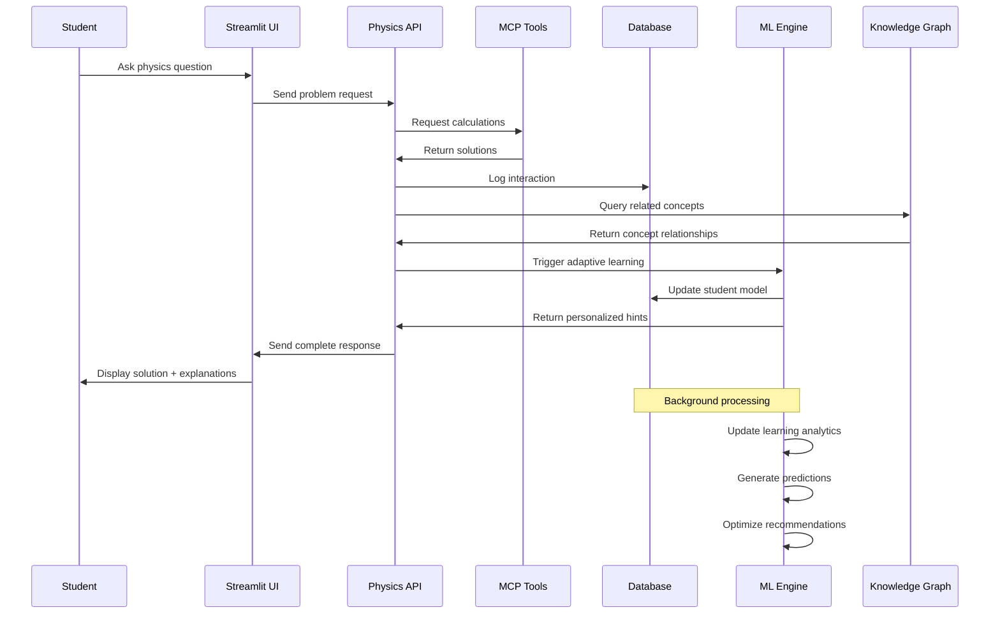
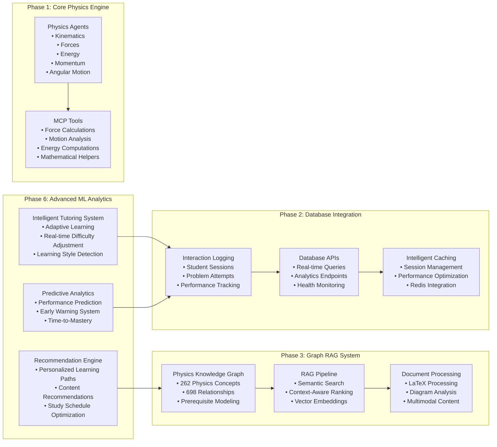
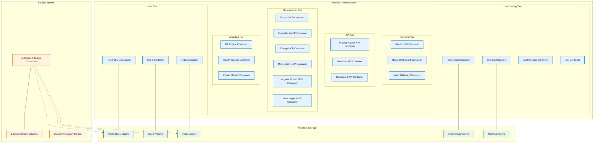

# Physics Assistant Platform Architecture

## System Overview Diagram

```mermaid
graph TB
    subgraph "User Interface Layer"
        UI[Streamlit Main UI<br/>:8501]
        DASH[React Analytics Dashboard<br/>:3000]
        NGX[Nginx Load Balancer<br/>:80/443]
    end
    
    subgraph "API Gateway Layer"
        PA[Physics Agents API<br/>:8000]
        DA[Database API<br/>:8001]
        DAPI[Dashboard API<br/>:8002]
    end
    
    subgraph "MCP Microservices"
        MCP1[Forces MCP<br/>:10100]
        MCP2[Kinematics MCP<br/>:10101]
        MCP3[Energy MCP<br/>:10102]
        MCP4[Momentum MCP<br/>:10103]
        MCP5[Angular Motion MCP<br/>:10104]
        MCP6[Math Helper MCP<br/>:10105]
    end
    
    subgraph "Database Layer"
        PG[(PostgreSQL<br/>Student Data<br/>:5432)]
        NEO[(Neo4j<br/>Knowledge Graph<br/>:7474/7687)]
        REDIS[(Redis<br/>Cache & Sessions<br/>:6379)]
    end
    
    subgraph "Analytics & ML Engine"
        ML[ML Processing Engine<br/>Intelligent Tutoring]
        PRED[Predictive Analytics<br/>Performance Prediction]
        REC[Recommendation Engine<br/>Learning Paths]
        TASK[Background Task Processor]
        FLOWER[Flower Monitor<br/>:5555]
    end
    
    subgraph "Monitoring Stack"
        PROM[Prometheus<br/>Metrics Collection<br/>:9090]
        GRAF[Grafana<br/>Visualization<br/>:3001]
        ALERT[Alertmanager<br/>:9093]
        LOKI[Loki<br/>Log Aggregation]
    end
    
    subgraph "Backup & Security"
        BACKUP[Automated Backup System<br/>PostgreSQL, Neo4j, Redis]
        VAULT[HashiCorp Vault<br/>Secrets Management]
        TRIVY[Container Security Scanning]
    end
    
    %% User interactions
    USER((Students & Instructors)) --> NGX
    NGX --> UI
    NGX --> DASH
    
    %% API connections
    UI --> PA
    UI --> DA
    DASH --> DAPI
    
    %% MCP tool connections
    PA --> MCP1
    PA --> MCP2
    PA --> MCP3
    PA --> MCP4
    PA --> MCP5
    PA --> MCP6
    
    %% Database connections
    PA --> PG
    PA --> NEO
    PA --> REDIS
    DA --> PG
    DA --> NEO
    DA --> REDIS
    DAPI --> PG
    DAPI --> NEO
    
    %% Analytics connections
    ML --> PG
    ML --> NEO
    PRED --> PG
    PRED --> NEO
    REC --> PG
    REC --> NEO
    TASK --> REDIS
    FLOWER --> TASK
    
    %% Monitoring connections
    PROM --> PA
    PROM --> DA
    PROM --> DAPI
    PROM --> PG
    PROM --> NEO
    PROM --> REDIS
    GRAF --> PROM
    ALERT --> PROM
    LOKI --> UI
    LOKI --> PA
    
    %% Backup connections
    BACKUP --> PG
    BACKUP --> NEO
    BACKUP --> REDIS
    
    %% Security
    VAULT --> PA
    VAULT --> DA
    VAULT --> DAPI
    TRIVY --> PA
    TRIVY --> DA
    TRIVY --> DAPI
    
    classDef frontend fill:#e1f5fe,stroke:#01579b,stroke-width:2px
    classDef api fill:#f3e5f5,stroke:#4a148c,stroke-width:2px
    classDef database fill:#e8f5e8,stroke:#1b5e20,stroke-width:2px
    classDef analytics fill:#fff3e0,stroke:#e65100,stroke-width:2px
    classDef monitoring fill:#fce4ec,stroke:#880e4f,stroke-width:2px
    classDef security fill:#f1f8e9,stroke:#33691e,stroke-width:2px
    
    class UI,DASH,NGX frontend
    class PA,DA,DAPI api
    class PG,NEO,REDIS database
    class ML,PRED,REC,TASK,FLOWER analytics
    class PROM,GRAF,ALERT,LOKI monitoring
    class BACKUP,VAULT,TRIVY security
```

## Data Flow Diagram

## Component Architecture

## Deployment Architecture

## Technology Stack

| Layer | Technology | Purpose |
|-------|------------|---------|
| **Frontend** | Streamlit + React + TypeScript | User interfaces and dashboards |
| **API Gateway** | FastAPI + Python | RESTful APIs and business logic |
| **Microservices** | MCP Protocol + Python | Physics calculation services |
| **Databases** | PostgreSQL + Neo4j + Redis | Data persistence and caching |
| **ML/Analytics** | Scikit-learn + PyTorch + Pandas | Machine learning and analytics |
| **Monitoring** | Prometheus + Grafana + Loki | Metrics, visualization, and logging |
| **Containerization** | Docker + Docker Compose | Service orchestration |
| **Security** | HashiCorp Vault + Trivy | Secrets management and scanning |
| **Backup** | Custom Scripts + S3 | Data protection and disaster recovery |

## Key Features

### 🎓 **Educational Intelligence**
- Adaptive tutoring with real-time difficulty adjustment
- Learning style detection and personalized content delivery
- Physics misconception detection and remediation
- Prerequisite concept modeling with knowledge graphs

### 📊 **Advanced Analytics**
- Student performance prediction (>85% accuracy)
- Early warning system for at-risk students
- Time-to-mastery estimation for physics concepts
- Comprehensive learning analytics dashboards

### 🔧 **Technical Excellence**
- Microservices architecture with 30+ containerized services
- Real-time processing with <200ms response times
- Enterprise-grade security and compliance
- Automated backup and disaster recovery
- High availability with load balancing and auto-scaling

### 🚀 **Deployment Options**
- Development: `docker-compose.development.yml`
- Production: `docker-compose.production.yml`
- Enterprise: `docker-compose.prod.yml` (High Availability)
- Kubernetes: Complete K8s manifests included